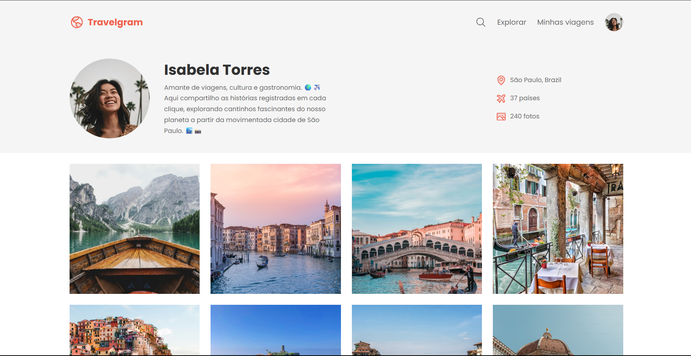

  

# Travelgram 🌍✈️

Uma página web de perfil e galeria de fotos inspirada em redes sociais, feita para amantes de viagens compartilharem seus registros pelo mundo. O layout apresenta um cabeçalho com informações do viajante e um mural em grade para exibir as fotografias.

## 🛠️ Tecnologias e Técnicas Utilizadas

Este projeto foi construído puramente com tecnologias fundamentais do Front-end:

* **HTML5:** Estruturação semântica do conteúdo usando tags como `<nav>`, `<header>`, `<main>` e `<footer>`.
* **CSS3:** Estilização visual detalhada, com foco em:
  * **Flexbox:** Utilizado para alinhar os itens do menu, organizar as informações laterais do perfil e criar a grade responsiva para as 12 fotos da galeria principal.
  * **Variáveis CSS (`:root`):** Implementadas para gerenciar e padronizar as cores da marca (como o destaque `#EF5F4C`) e a tipografia.
  * **Efeitos de Hover:** Interatividade visual ao passar o mouse sobre os links do menu.
* **Google Fonts:** Aplicação da família tipográfica "Poppins" para um design mais limpo e moderno.

## 🚀 Como abrir o projeto

Você tem duas formas de explorar esse projeto:

**1. Demonstração ao Vivo (Mais prático):**
Quer ver o projeto funcionando agora mesmo, sem precisar baixar nenhum arquivo? Acesse o link abaixo:
👉 **[Visitar o site Travelgram](https://alissonfa.github.io/Travelgram/)**

**2. No seu computador (Para explorar os códigos):**
Caso você queira abrir o projeto localmente na sua máquina:
* Faça o download dos arquivos para o seu computador.
* Certifique-se de que a estrutura de pastas está correta (o arquivo principal `index.html` solto na pasta principal e a pasta `./assets/` com os ícones e imagens).
* Dê um duplo clique no arquivo `index.html`. O site abrirá automaticamente no seu navegador de internet padrão!

---
*Projeto desenvolvido para aprimorar habilidades de estruturação em HTML e estilização com CSS.*